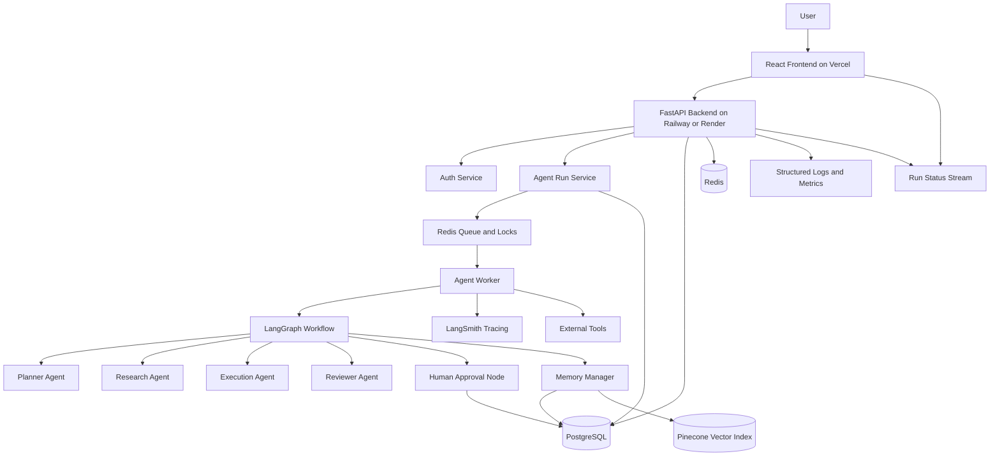
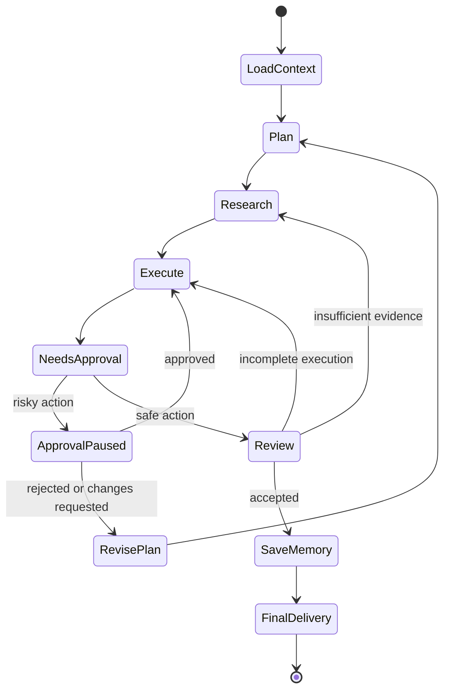
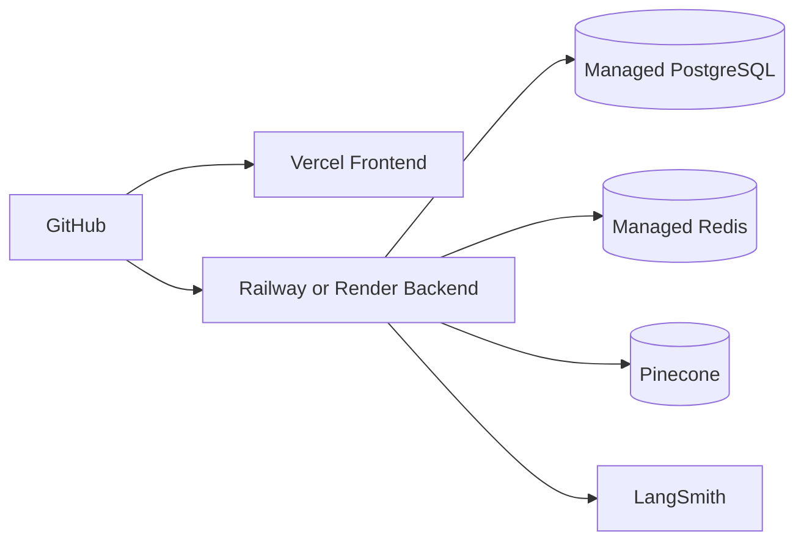

# Architecture Diagram

## High-Level Architecture

## LangGraph Workflow

## Why This Architecture

- **FastAPI** provides a typed, async backend boundary for auth, APIs, webhooks, and streaming run updates.
- **React** gives users a clear workspace for goals, plans, research, approvals, and final delivery.
- **LangGraph** makes the agent workflow explicit, resumable, testable, and safe to interrupt.
- **PostgreSQL** stores authoritative SaaS data, run state, checkpoints, approvals, and cost records.
- **Redis** supports fast coordination: queues, locks, idempotency, rate limits, and ephemeral status.
- **Pinecone** provides semantic retrieval for long-term memories and research artifacts.
- **LangSmith** gives model/tool traces required for debugging and evaluation.

## Deployment Topology

