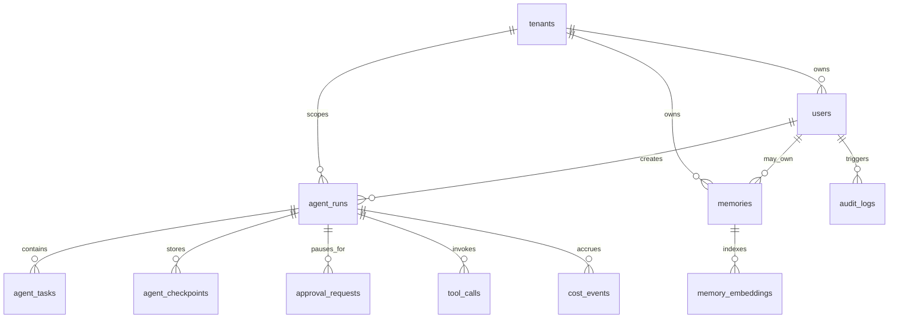

# Database Design

## Why The Database Matters

Autonomous agents are stateful systems. Without a durable database design, the product cannot safely resume workflows, audit decisions, isolate tenants, track cost, or explain final outputs.

## Core PostgreSQL Tables

| Table | Purpose |
| --- | --- |
| `tenants` | SaaS account boundary and billing owner |
| `users` | Authenticated users within tenants |
| `api_keys` | Hashed service credentials for tenant integrations |
| `agent_runs` | Top-level user goal execution record |
| `agent_tasks` | Planner-created task units |
| `agent_checkpoints` | Durable graph resume points |
| `approval_requests` | Human approval gates and decisions |
| `tool_calls` | Tool invocation audit trail |
| `memories` | Structured long-term user and tenant memory metadata |
| `memory_embeddings` | Pinecone vector references and chunk metadata |
| `cost_events` | Token, tool, and provider cost tracking |
| `audit_logs` | Security-sensitive and compliance-relevant events |

## Entity Relationships

## Important Columns

### `agent_runs`

- `id`: UUID primary key
- `tenant_id`: tenant owner
- `user_id`: creator
- `goal`: original user goal
- `status`: `queued`, `running`, `waiting_for_approval`, `completed`, `failed`, `cancelled`
- `graph_version`: workflow version used for the run
- `current_node`: current LangGraph node
- `final_output`: final delivery payload
- `created_at`, `updated_at`, `completed_at`

### `agent_checkpoints`

- `id`: UUID primary key
- `run_id`: parent run
- `node_name`: graph node checkpointed
- `state_json`: serialized graph state
- `checkpoint_version`: schema version
- `created_at`

### `approval_requests`

- `id`: UUID primary key
- `run_id`: parent run
- `task_id`: optional risky task
- `risk_level`: `low`, `medium`, `high`, `critical`
- `proposed_action`: action awaiting approval
- `status`: `pending`, `approved`, `rejected`, `changes_requested`, `expired`
- `decided_by`: approving user
- `decision_reason`: human explanation
- `created_at`, `decided_at`

### `cost_events`

- `id`: UUID primary key
- `tenant_id`, `user_id`, `run_id`
- `node_name`
- `provider`
- `model`
- `prompt_tokens`, `completion_tokens`, `total_tokens`
- `estimated_cost_usd`
- `latency_ms`
- `status`

## Redis Data Design

| Key Pattern | Purpose | TTL |
| --- | --- | --- |
| `run:{run_id}:status` | Fast status reads and streaming updates | 24 hours |
| `lock:run:{run_id}` | Prevent duplicate worker execution | 10 minutes renewed |
| `rate:{tenant_id}:{window}` | Tenant rate limiting | Window length |
| `idempotency:{key}` | Prevent duplicated API submissions | 24 hours |
| `queue:agent-runs` | Pending background jobs | Until processed |

## Pinecone Metadata Design

Each vector should include metadata:

- `tenant_id`
- `user_id` when user-specific
- `memory_id`
- `source_type`: `user_preference`, `run_artifact`, `research_note`, `document`
- `created_at`
- `sensitivity`: `public`, `internal`, `confidential`

## Design Rules

1. PostgreSQL is the source of truth.
2. Redis is not a source of truth.
3. Pinecone stores vectors and retrieval metadata, not sensitive raw secrets.
4. Every table with tenant data must include `tenant_id` directly or through a strict parent relationship.
5. Every external action must be traceable through `tool_calls` and `audit_logs`.
